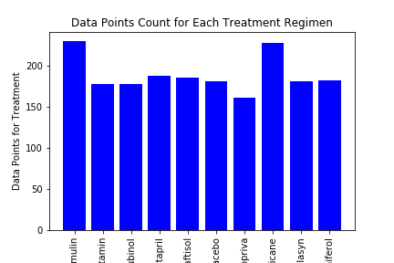
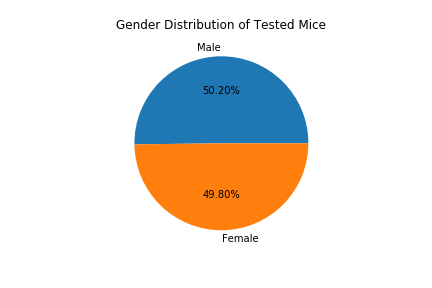
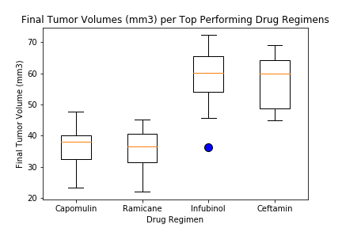
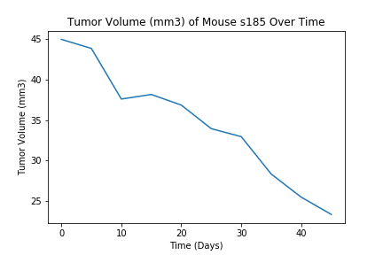
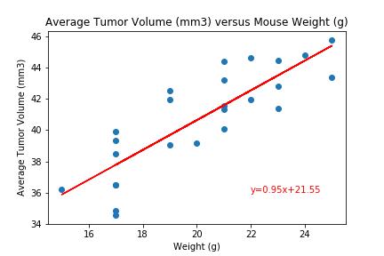

# Pymaceuticals
For this project, we looked at two CSV files containing data from a study on tumor medicines tested on mice. The main purpose was to compare results from 10 drug regimens using both matplotlib and pandas plotting methods.

1. CSV files were read in using pandas

2. Resulting dataframes were merged using pandas

3. The average and median tumor volumes were calculated for each medicine studied, as well as the variance, standard deviation, and standard error

4. Bar plots were created to compare the amount of data points for each medicine studied
> 

5. Pie charts were created to compare the number of male and female mice studied
> 

6. A boxplot showing the IQR and any potential outliers for the top four performing drug regimens, Capomulin, Ramicane, Infubinol, and Ceftamin, was made
> 

7. The tumor volume over time of the top performing drug regimen, Capomulin, was plotted
> 

8. A scatterplot was made showing the average tumor volume versus mouse weight from the top performing drug regimen, Capomulin, was made
> 

## Important Obersvations and Insights

>There were an equal amount of female and male mice tested, so the results may mean these drugs were tested equally on either gender. However, further analysis would be required to see if that is entirely accurate.

>The two top performers were undoubtedly Capomulin and Ramicane. Although Capomulin seemed to be the number one performer overall, Ramicane had slightly lower values across the board regarding the average and median tumor volumes, variance, standard deviation, and standard error.

>According to the scatter plot showing average tumor volume and mouse weight, there seems to be a fairly direct, positive correlation between the weight of the mouse and the volume of the tumor.
